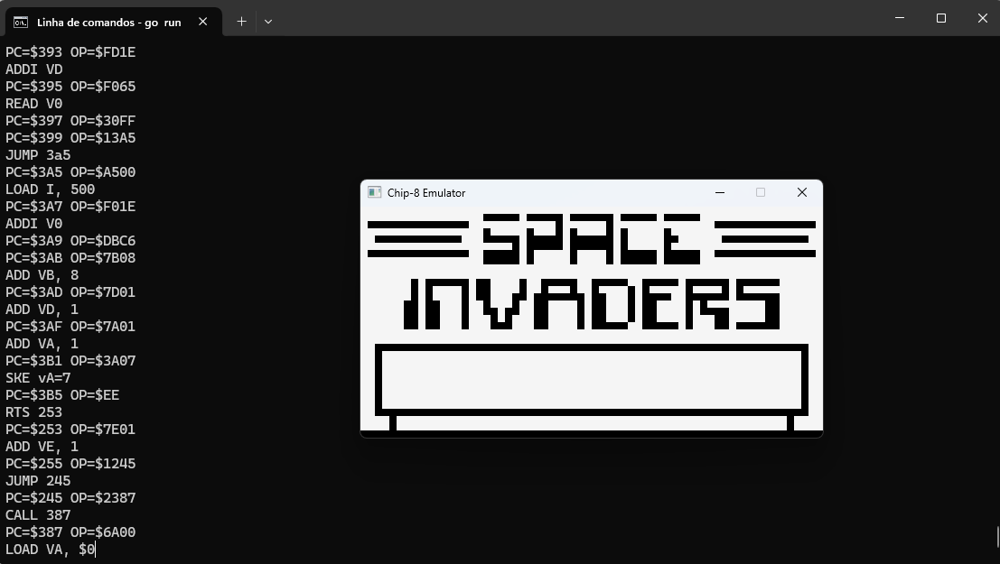
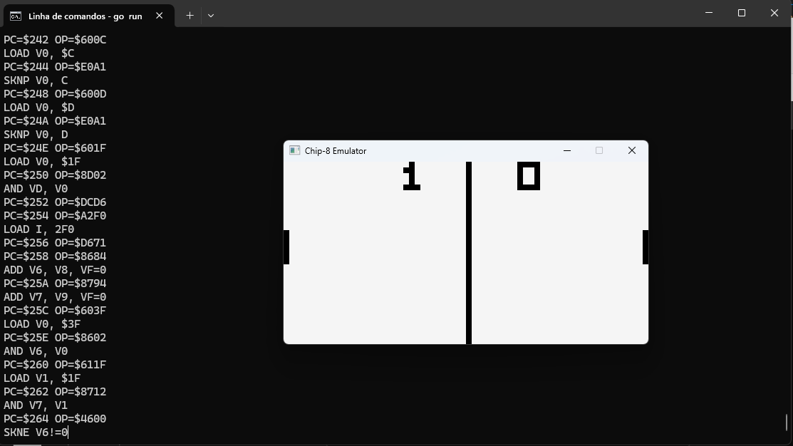

# Stunning Flop

Sample chip-8 emulator written in Go.

Video/Keyboard handling is done by using the amazing raylib [library](https://github.com/gen2brain/raylib-go).

## Running on Windows

In order to run the emulator locally on Windows, we embedded the `raylib.dll` file inside the root path of this project. That's the only dependency besides `go >= 1.22` to run the project (CGO is not needed).

Inside the `test-roms` folder there are many public Chip-8 Roms available from the internet, to run one of this ROMs just open a command prompt and type:

```prompt
go run main.go -f test-roms\$ROM_NAME
```

## Using

`ESC`: Quits the emulator

### Keyboard

The chip-8 keyboard mapping was taken from [here](https://multigesture.net/articles/how-to-write-an-emulator-chip-8-interpreter/).

```plaintext
Chip-8 Pinpad            Keyboard
+-+-+-+-+                +-+-+-+-+
|1|2|3|C|                |1|2|3|4|
+-+-+-+-+                +-+-+-+-+
|4|5|6|D|                |Q|W|E|R|
+-+-+-+-+       =>       +-+-+-+-+
|7|8|9|E|                |A|S|D|F|
+-+-+-+-+                +-+-+-+-+
|A|0|B|F|                |Z|X|C|V|
+-+-+-+-+                +-+-+-+-+
```

## Screenshots

### Invaders



### Pong



# References

I wouldn't be able to to this this work without the help of many other emulator developers, so here's the list of references I used:

- https://www.craigthomas.ca/blog/2014/06/21/writing-a-chip-8-emulator-part-1/
- http://devernay.free.fr/hacks/chip8/C8TECH10.HTM#Fx07
- https://omokute.blogspot.com/2012/06/emulation-basics-write-your-own-chip-8.html
- https://austinmorlan.com/posts/chip8_emulator/
- https://multigesture.net/articles/how-to-write-an-emulator-chip-8-interpreter/